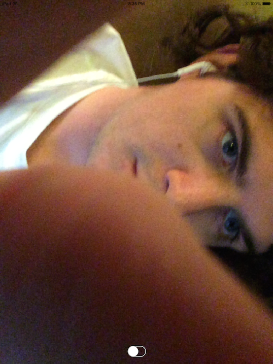

#iOSSwiftMetalCamera

[Click here to see video demo.](https://www.youtube.com/watch?v=cM1ncSkGMUs)

 

This app is a basic example showing how to use Swift to setup an AVCaptureSession session to access the device's camera, pass video frames to a Metal environment, and dynamically apply shaders to it. You can also manipulate the 3D space containing the plane on which the video is seen using touch controls in this example.

👇 Drag your finger on the screen when running the app to manipulate the camera output in 3D. 👇
